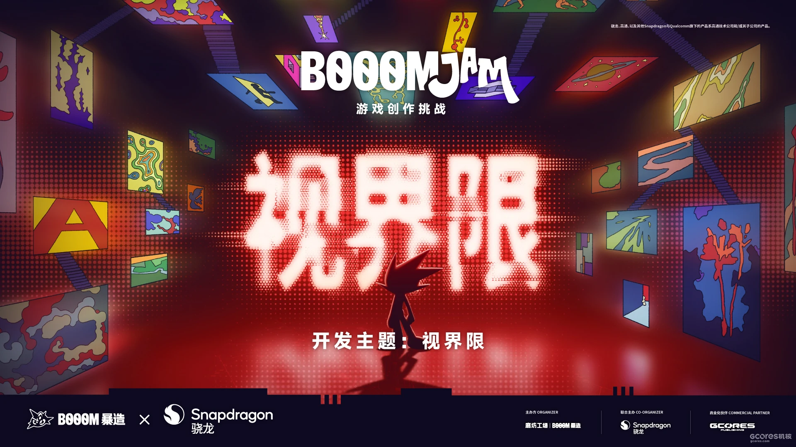
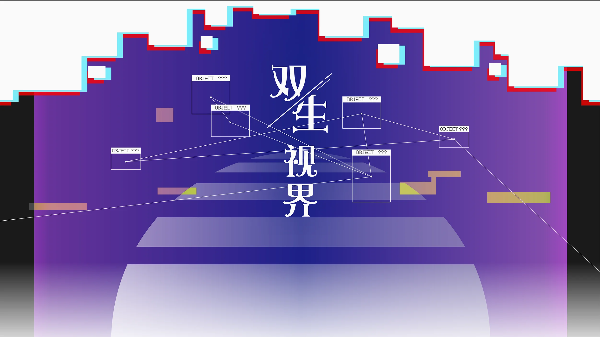
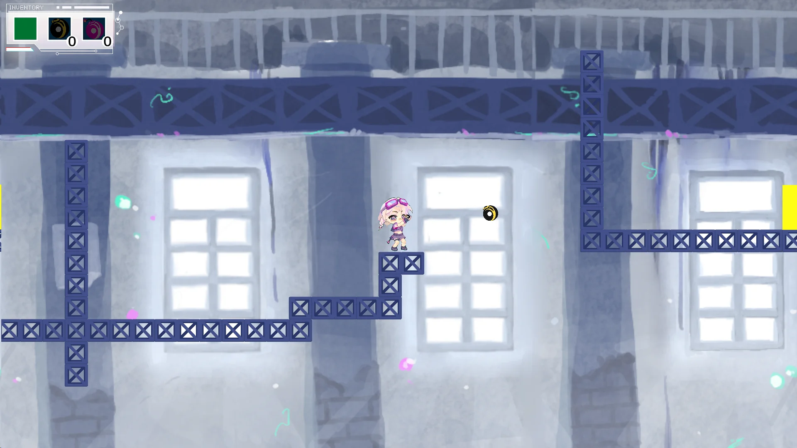
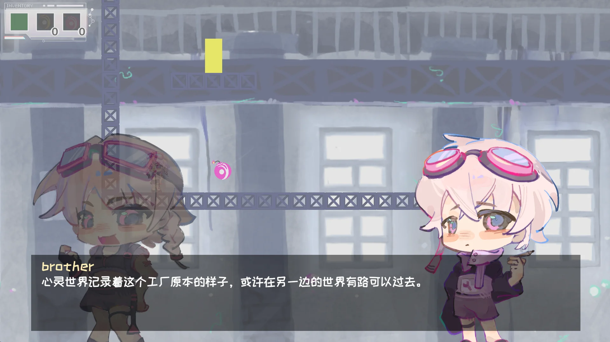
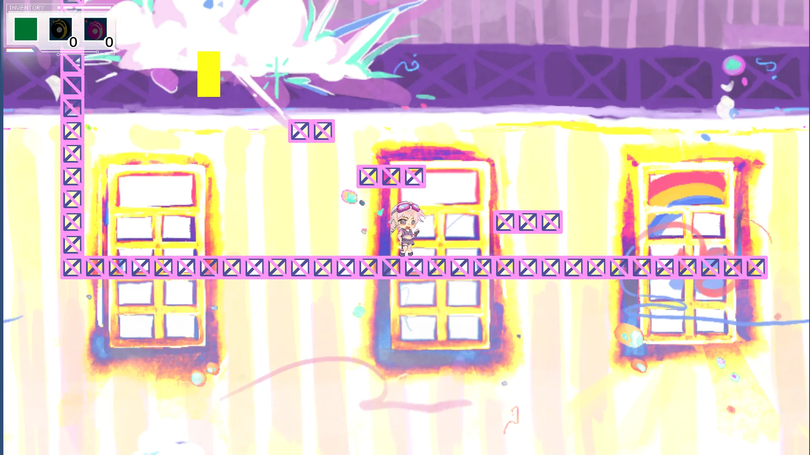

# 🌌 双生视界 (Twins' Horizon)

> **华中科技大学 MEMO 游戏工作室** 2026春季新人项目
> **2026 春季 BOOOM Jam** 参赛作品

 

🔗 **在线试玩 & 游戏详情：** [在机核网(GCORES)上游玩/查看《双生视界》](https://www.gcores.com/games/179931)
🔗 **Jam活动主页：** [2026春季 BOOOM Jam](https://www.gcores.com/articles/213478)

---

## 🎮 游戏简介
《双生视界》是一款以**“表里世界切换”**为核心玩法的 2D 平台跳跃闯关游戏。
玩家需要在两个截然不同的平行维度（表/里世界）之间进行实时切换，利用两个世界中不同的地形、机关和物理规则，跨越障碍，解开谜题，最终抵达关卡终点。

### ✨ 核心机制 (Features)
- **无缝维度切换**：一键在表、里世界间穿梭，地形与机关状态即时改变。
- **平台跳跃与解谜结合**：利用两个世界的地形差异设计的高难度跳跃与烧脑谜题。
- **独特的美术氛围**：两个世界拥有截然相反的视觉风格与情感表达。

---

## 📷 游戏截图

  
  

  
  

---

## 🧑‍💻 个人职责与技术实现 (My Contributions)

本项目由 **4人团队（1策划，1程序，2美术）** 合作完成。
在本项目中，我担任**唯一的客户端程序员**，负责了游戏从0到1的**几乎所有功能开发与底层逻辑实现**。

### 🛠️ 技术栈
- **游戏引擎：** Unity 2022.3.62f3
- **编程语言：** C#
- **版本控制：** Git / Gitea / GitHub

### 🌟 核心开发工作

1. **表里世界切换系统 (World Switching System)**
   - 使用了观察者模式处理世界切换的全局广播，确保场景中所有机关、地形在切换瞬间同步响应。
   - 实现了双套碰撞体(Collider)和渲染层(Layer/Camera Mask)的动态激活与遮罩，确保切换过程的无缝与性能优化。

2. **2D 角色控制器 (Player Controller)**
   - 基于 Unity 物理系统 (Rigidbody2D / Raycast) 编写了手感严密的平台跳跃控制器。
   - 集成 Animator 状态机，平滑处理角色移动、跳跃、下落、切换等动画过渡。

3. **关卡机制与交互 (Level Mechanics & Interactions)**
   - 开发了高度解耦的机关基类系统，方便策划通过 Inspector 进行快速配置。
   - 编写了仅存在于特定世界（表/里）的特殊交互逻辑。

4. **UI 与系统框架 (UI & System Architecture)**
   - 搭建了基础的游戏流程框架（GameManager / UIManager）。
   - 完成了主菜单、选关界面、暂停菜单及游戏结算逻辑的开发与场景异步加载。

---

## 👥 开发团队 (Credits)
- **程序 (Programmer)：** [Dulst] (GitHub: [@DulstAminos](https://github.com/DulstAminos))
- **策划 (Game Designer)：** [时川]
- **美术 (Artists)：** [浅灰色太阳], [陷光星]

感谢华中科技大学 MEMO 游戏工作室的平台支持。